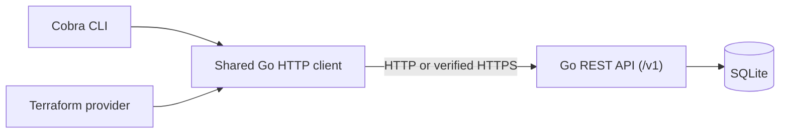

# flagctl

[](https://github.com/ahmedr1zwan/flagctl/actions/workflows/ci.yml)

Manage boolean feature flags independently across environments through a
versioned REST API. Built in Go with SQLite persistence, flagctl supports the
complete flag lifecycle: create, list, read, enable/disable, edit, and delete.
The Cobra CLI supports create, list, get, toggle, and delete with table or JSON output.
The Terraform Plugin Framework provider manages the same flags declaratively,
including import and drift reconciliation.

| Component | Status |
| --- | --- |
| Go REST service and persistent SQLite storage | Implemented |
| Environment isolation, input validation, and local access protections | Implemented |
| TLS and file-based bearer authentication across service, CLI, and provider | Implemented |
| Cobra CLI lifecycle with JSON/table output | Implemented |
| Terraform Plugin Framework provider lifecycle, import, and drift | Implemented; local build |
| Validation, SQLite, REST API, client, and command tests with race checks | Implemented |
| Provider unit and Terraform acceptance tests with race checks | Implemented |
| API compatibility policy, frozen fixtures, and historical-client checks | Implemented |
| Docker/Compose with authenticated TLS, health checks, and persistent storage | Implemented |
| GitHub Actions Go, Terraform, Docker, and vulnerability checks | Passing on Linux amd64 |
| GoReleaser and published binaries | Release workflow implemented; first publication pending |

The default mode is for local development; authenticated TLS access is also
available, including through Docker. Verification results and the remaining
milestones are recorded in [TODO.md](TODO.md) and [PLAN.md](PLAN.md).

Architecture:



## Install binaries

Download a platform bundle from [GitHub Releases](https://github.com/ahmedr1zwan/flagctl/releases).
The [release installation guide](docs/releases.md) covers Linux/macOS on Intel/ARM,
SHA-256 verification, a service/CLI quickstart, and installation of the bundled
Terraform provider through a local filesystem mirror. No Go compiler is needed.
Terraform Registry publication remains separate.

## Build and run from source

Use Go 1.27.1 or a newer supported, patched release. The `go.mod` minimum selects
Go 1.27.1; an older Go installation with automatic toolchain selection enabled
downloads it on the first build. This does not replace your system Go installation.
See [Go downloads](https://go.dev/dl/) and
[toolchain selection](https://go.dev/doc/toolchain).

From this repository's directory:

```sh
go build -o bin/flagd ./cmd/flagd
./bin/flagd
```

Expect a log line containing `flagd listening` and `address=127.0.0.1:8080`.
Leave that terminal running. No API keys, `.env` file, or external database server
are needed. The service creates `data/flags.db` under the working directory.
SQLite uses the pinned [modernc.org/sqlite](https://pkg.go.dev/modernc.org/sqlite)
driver, which builds without a C compiler. The first build downloads dependencies.

If a previous checkpoint's server is running, stop it with Ctrl+C before starting
the rebuilt binary. Otherwise it will still serve the older code.

In a second terminal:

```sh
curl --noproxy '*' -i http://127.0.0.1:8080/healthz
```

Expect `HTTP/1.1 200 OK`, `Content-Type: application/json`, and:

```json
{"status":"ok"}
```

Stop the server with **Ctrl+C** in the first terminal. It logs `flagd stopped` and
exits cleanly. Running the curl command again should fail to connect.

If port 8080 is occupied, choose another loopback port:

```sh
./bin/flagd --listen 127.0.0.1:8081
curl --noproxy '*' -i http://127.0.0.1:8081/healthz
```

`--listen '[::1]:8080'` supports IPv6 loopback. Port `0` selects an available port,
which is printed in the startup log. Listen hostnames are rejected; wildcard and
non-loopback IPs require explicit secure configuration. See the
[secure-access guide](docs/security.md) for TLS, token files, and network access.
`./bin/flagd --help` prints the available options.

## Run with Docker

The [Docker quickstart](docs/docker.md) creates private development credentials,
configures a non-root container, and starts the service with Compose. After
exporting the variables in that guide:

```sh
docker compose up --build --wait --wait-timeout 90
docker compose ps
```

The service uses verified HTTPS on host loopback, a read-only root filesystem,
and a named SQLite volume. The CLI and provider connect from the host using the
same token/CA file settings as native secure mode. Both container restart and
replacement preserve flags. `docker compose down` stops the service while keeping
the database; `down --volumes` deliberately removes it.

## Use the CLI

With `flagd` running, build and use the CLI from a second terminal in the repository:

```sh
go build -o bin/flagctl ./cmd/flagctl

./bin/flagctl flags create checkout_v2 --env dev --description "New checkout"
./bin/flagctl flags list --env dev
./bin/flagctl flags list --env dev --output json
./bin/flagctl flags create checkout_v2 --env prod --enabled=true --output json
```

Default table output:

```text
ENVIRONMENT  KEY          ENABLED  DESCRIPTION
dev          checkout_v2  false    New checkout
```

`--env` is required. Create defaults to disabled with an empty description.
Use `--enabled=true` or `--enabled=false` to set the initial state. Repeating a
create fails with a useful `HTTP 409, already_exists` error and leaves the record
unchanged. The CLI and curl examples below share the same demo flags, so run either
creation example first; the other will then report a duplicate.

JSON create/get/toggle output is one flag object; JSON list output is `{"flags":[...]}`.
An empty environment produces `{"flags":[]}`, or just the header in table mode.
Successful output goes to stdout; errors go to stderr with exit code 1 and no
result on stdout. Use JSON for scripts; table descriptions escape control
characters and line breaks. For example:

```sh
./bin/flagctl flags list --env dev -o json | python3 -m json.tool
./bin/flagctl flags create --help
./bin/flagctl flags list --help
```

Continue the CLI demo with the dev and prod flags created above:

```sh
# Read one flag, including its timestamps.
./bin/flagctl flags get checkout_v2 --env dev --output json

# Set an explicit state. Repeating the command preserves that state.
./bin/flagctl flags toggle checkout_v2 --env dev --enabled=true
./bin/flagctl flags toggle checkout_v2 --env dev --enabled=false --output json

# Delete only the dev flag. The prod flag remains available.
./bin/flagctl flags delete checkout_v2 --env dev --output json
./bin/flagctl flags get checkout_v2 --env prod
```

`toggle` requires `--enabled=true` or `--enabled=false`; omitting the option or
its value fails before making a request. It preserves the description and
creation timestamp. Repeating a command that changes nothing also preserves
the update timestamp. Get, toggle, and delete each require exactly one key and
an explicit environment. A missing flag returns `HTTP 404, not_found`; a second
delete also fails with 404.

After the service acknowledges deletion with HTTP 204, the CLI produces this
JSON confirmation (the REST response itself has no body):

```json
{"environment":"dev","key":"checkout_v2","deleted":true}
```

The default delete table uses `ENVIRONMENT`, `KEY`, and `DELETED` columns.
These commands remove the dev demo flag; create it again if you want to try
the REST update examples below.

Server configuration uses this precedence: explicit `--server`, then a nonempty
`FLAGCTL_SERVER`, then `http://127.0.0.1:8080`. `--timeout` defaults to `10s` and must
be positive. `--output` (or `-o`) accepts `table` or `json`.

For a server already running on port 8081:

```sh
./bin/flagctl --server http://127.0.0.1:8081 flags list --env dev
FLAGCTL_SERVER=http://127.0.0.1:8081 ./bin/flagctl flags list --env dev --timeout 5s
```

The client accepts HTTP loopback origins and HTTPS origins. Remote HTTPS requires
`--token-file`; credentials are never sent over HTTP. `--ca-file` selects a PEM
CA bundle while preserving certificate and hostname checks. Both have environment
fallbacks described in the [secure-access guide](docs/security.md).
Credentials in URLs, non-root paths, queries, and fragments are rejected without
echoing their values. Requests bypass proxy environment variables and redirects
are not followed. Responses are limited to 8 MiB and decoded with validation
while tolerating additive response fields.

Stop `flagd` and repeat `flags list` to check connection-error handling. Ctrl+C
cancels an in-progress request. The CLI does not automatically retry operations:
if a mutation times out, is interrupted, or returns an invalid response, use
`flags get` or `flags list` to check the current state before retrying. The
service may already have committed the change. Restarting `flagd` with the same
data directory preserves creations, updates, and deletions made through the CLI.

## Manage flags with Terraform

The local provider exposes one `flagctl_flag` resource:

```hcl
terraform {
  required_providers {
    flagctl = {
      source = "ahmedr1zwan/flagctl"
    }
  }
}

provider "flagctl" {}

resource "flagctl_flag" "checkout" {
  environment = "dev"
  key         = "terraform_checkout"
  description = "Checkout managed by Terraform"
  enabled     = true
}
```

Build and configure the local provider using the [Terraform guide](docs/terraform.md),
then run the [example](examples/terraform/main.tf). The guide covers apply,
no-op plans, updates, CLI-induced drift, import, replacement, and destroy.
The provider has not been published to the Terraform Registry; the guide uses
a development override and skips `terraform init` for this local example.
No API keys or cloud account are needed.

## Create and read flags over REST

With the service running, use a second terminal:

```sh
# Create: 201 Created, Location header, and the new flag.
curl --noproxy '*' -i http://127.0.0.1:8080/v1/environments/dev/flags \
  -H 'Content-Type: application/json' \
  -d '{"key":"checkout_v2","description":"New checkout"}'

# List dev flags: 200 and {"flags":[...]} sorted by key.
curl --noproxy '*' -i http://127.0.0.1:8080/v1/environments/dev/flags

# Read one flag: 200 and the same flag object.
curl --noproxy '*' -i http://127.0.0.1:8080/v1/environments/dev/flags/checkout_v2

# The same key in prod can have a different value: 201, enabled=true.
curl --noproxy '*' -i http://127.0.0.1:8080/v1/environments/prod/flags \
  -H 'Content-Type: application/json' \
  -d '{"key":"checkout_v2","enabled":true}'
```

The dev flag defaults to `enabled: false`. Timestamps are generated by the
service in UTC. Omitted descriptions default to an empty string. Repeating a
create in the same environment returns **409** and leaves the existing record
unchanged. An environment without any records returns `{"flags":[]}`.

Flag responses also include a read-only `id`, such as `dev/checkout_v2`, matching
Terraform's import identifier. The field was added with passing checks against
the original v1 response contract and an archived client. See the
[compatibility policy](docs/api-v1.md#v1-compatibility-policy).

To verify persistence, stop the server with Ctrl+C, run `./bin/flagd` again from
the same directory, and repeat the list/get requests. Both environments' flags
should still exist. To repeat the whole demo with empty storage, use a **new**
directory, for example `./bin/flagd --data-dir .cache/demo-2`; this preserves
your original database.

## Update and delete flags

After creating `checkout_v2` in dev with the commands above:

```sh
# Enable: 200, enabled=true; description stays unchanged.
curl --noproxy '*' -i -X PATCH http://127.0.0.1:8080/v1/environments/dev/flags/checkout_v2 \
  -H 'Content-Type: application/json' -d '{"enabled":true}'

# Disable and clear the description together: 200.
curl --noproxy '*' -i -X PATCH http://127.0.0.1:8080/v1/environments/dev/flags/checkout_v2 \
  -H 'Content-Type: application/json' -d '{"enabled":false,"description":""}'

# Delete only the dev flag: 204, no response body.
curl --noproxy '*' -i -X DELETE http://127.0.0.1:8080/v1/environments/dev/flags/checkout_v2

# Read after deletion: 404. The prod flag is unaffected.
curl --noproxy '*' -i http://127.0.0.1:8080/v1/environments/dev/flags/checkout_v2
```

PATCH requires at least one of `enabled` or `description`. Omitted fields stay
unchanged, `false` disables, and `""` clears the description. Updates preserve
`created_at`; repeating a PATCH that changes nothing preserves `updated_at` too.
Identity and timestamps cannot be supplied in a PATCH. Missing records return
404 for both PATCH and DELETE; a repeated DELETE also returns 404.

Updates use a transaction so concurrent partial edits preserve each other's
omitted fields. Concurrent changes to the same field use last-write-wins
semantics. Restart the service after a PATCH to verify the change persists, then
restart it after DELETE to verify the record stays absent.

## Data storage

`--data-dir` selects a dedicated directory; its default is `data` relative to the
process's working directory. The database name inside it is always `flags.db`.
Starting from a different working directory selects a different default database;
use an absolute `--data-dir` when you need a fixed location.

New data directories use Unix mode `0700`, and database files use `0600`. Existing
directories/files with group or other permissions are rejected. The data directory
itself and the database/SQLite sidecar files must not be symlinks. Use a dedicated,
trusted directory on a local filesystem. Do not point the service at someone
else's SQLite file. These permission checks target macOS/Linux; they do not
provide encryption or protection from other programs running as your user.

The store has a versioned schema, a unique `(environment, key)` constraint,
parameterized queries, and one pooled database connection to serialize operations.
This checkpoint targets one service instance and small local datasets. Listing
returns all flags in the chosen environment; pagination is not implemented.

## Verify errors and access protections

With the server running on its default port:

```sh
# Health checks support HEAD too: 200, with no response body.
curl --noproxy '*' -I http://127.0.0.1:8080/healthz

# Wrong method: 405, Allow: GET, HEAD, and a JSON error.
curl --noproxy '*' -i -X POST http://127.0.0.1:8080/healthz

# Missing flag: 404 and a JSON error.
curl --noproxy '*' -i http://127.0.0.1:8080/v1/environments/dev/flags/missing

# Invalid identifier: 400; no record is created.
curl --noproxy '*' -i http://127.0.0.1:8080/v1/environments/dev/flags \
  -H 'Content-Type: application/json' -d '{"key":"INVALID KEY"}'

# Cross-origin browser mutation: 403; no record is created.
curl --noproxy '*' -i http://127.0.0.1:8080/v1/environments/dev/flags \
  -H 'Origin: https://unrelated.example' \
  -H 'Content-Type: application/json' -d '{"key":"blocked"}'
```

Creation and updates require JSON. Missing/wrong content types return 415, request bodies
larger than 16 KiB return 413, and invalid JSON/types, unknown/duplicate fields,
or explicit `null` values return 400. Descriptions are limited to 1,024 UTF-8
bytes. Unsupported methods such as PUT return 405. DELETE requires no JSON body
or content-type header. See the [API contract](docs/api-v1.md) for details.

Verify the server refuses to expose itself on your network:

```sh
./bin/flagd --listen 0.0.0.0:8080
echo $?
```

Expect a loopback-address error and exit code `1`. No listener is started by
that command.

Build/static checks, from the repository directory:

```sh
go build ./...
go vet ./...
go mod verify
gofmt -l cmd internal
```

Build, vet, and formatting checks print nothing when successful; module
verification prints `all modules verified`. Run the committed tests with:

```sh
go test ./...
CGO_ENABLED=1 go test -race -shuffle=on ./...
```

The suite covers validation, SQLite persistence/concurrency, HTTP behavior and
access protections, client failures, CLI workflows/output, process exit codes,
and service shutdown/restart. Provider unit tests cover configuration, validation,
import IDs, and state preservation on API failures. Tests use temporary databases
and local servers; no keys or running service are needed.

The normal suite also replays frozen v1 wire fixtures and builds a historical
client in a separate module. To run just the compatibility checks:

```sh
go test ./internal/api -run '^Test(V1|FlagResponseID)' -count=1
```

With an installed Terraform CLI, run the separate acceptance suite:

```sh
TF_ACC=1 go test ./internal/provider -run '^TestAcc' -count=1 -timeout=10m
```

Acceptance tests exercise real Terraform plans, apply, import, drift, replacement,
and destroy against an isolated service. They are skipped in ordinary `go test`
runs unless `TF_ACC=1`. See the [test guide](docs/testing.md) for requirements,
coverage, and commands, and [TODO.md](TODO.md#verification-log) for recorded results.

[GitHub Actions CI](.github/workflows/ci.yml) runs on pull requests and pushes to
`main`. Separate jobs check Go formatting/vet/builds/tests with race detection,
real Terraform acceptance, the Docker lifecycle, and known vulnerabilities.
Tests create isolated services, storage, and temporary credentials; no personal
keys or externally running service are needed. See the
[CI guide](docs/testing.md#github-actions) to reproduce checks or inspect failures.

To repeat the known-vulnerability check (requires internet access):

```sh
go run golang.org/x/vuln/cmd/govulncheck@v1.8.0 -test ./...
```

The September 15 local and hosted scans reported `No vulnerabilities found.`
CI also scans the archived client module separately. The scanner is a development
tool and does not add a dependency to the application module. It checks known
vulnerabilities, not every possible security defect.

## Security and credentials

- Default HTTP mode binds only to loopback and is unauthenticated. Local
  processes can reach it. Use [secure mode](docs/security.md) for authentication;
  network listeners additionally require `--allow-network` and `--public-origin`.
- Secure mode uses TLS 1.3 and private token/key files. The token grants full flag
  access across environments. Credentials stay outside the repository and are
  loaded from paths, never raw-token command-line options or Terraform attributes.
- Header/read/write/idle timeouts, a 16 KiB request-body limit, and bounded database
  contexts constrain requests. Responses use `no-store` and `nosniff`. There are
  no file-serving/debug endpoints or permissive CORS headers.
- Host must match the bound local address or configured HTTPS public origin.
  Browser-origin protection rejects unsafe cross-origin mutations. Logs omit
  headers, query strings, bodies, raw database errors, and TLS handshake contents.
- The CLI and provider verify certificates and hostnames, reject redirects, and
  bypass proxy settings. Errors omit sensitive inputs. Terraform state/plan files
  contain flag values and descriptions; keep them private. Tokens are not stored
  in resource state. Local provider overrides remain for development.
- `.gitignore` excludes common `.env`, private-key, credential, database, and
  Terraform state/plan files. Ignore rules are a guardrail: they do not detect
  secrets pasted into source, protect already tracked files, or encrypt data.
  Keep real credentials outside this repository and never force-add secret files.
- Feature-flag **keys** such as `checkout_v2` are identifiers, not API credentials.
  Flag descriptions and values must not become a secret store.

Keep Go patched. The Go project maintains security fixes for its two most recent
major release lines; Go 1.25.5, originally installed in this workspace, is older
than those lines as of September 12, 2026. See
[Go's security guidance](https://go.dev/doc/security/). This checkpoint does not
constitute a production security audit.

## Files to explore

- `cmd/flagd/main.go`: options, listener access policy, server limits, and shutdown.
- `cmd/flagctl/main.go` and `internal/cli/`: Cobra commands, output, and cancellation.
- `internal/security/` and [secure-access guide](docs/security.md): token files, TLS, and origins.
- `internal/client/`: shared HTTP client, endpoint validation, and typed API errors.
- `cmd/terraform-provider-flagctl/` and `internal/provider/`: provider configuration,
  flag schema, lifecycle, import, and state refresh.
- [Terraform guide](docs/terraform.md) and [example](examples/terraform/main.tf):
  build and run the local provider.
- [Docker guide](docs/docker.md), `Dockerfile`, and `compose.yaml`: secure containers and persistence.
- [Release guide](docs/releases.md): binary installation, snapshot checks, and tagged publishing.
- [Test guide](docs/testing.md): current automated suites and verification scope.
- `internal/api/`: routing, Host/origin protections, strict request decoding, and JSON errors.
- `internal/flags/flag.go`: flag model and input validation.
- `internal/store/`: private SQLite files, schema initialization, and flag queries.
- [API contract](docs/api-v1.md): implemented routes, payloads, errors, and compatibility policy.
- [Plan](PLAN.md) and [checklist](TODO.md): next increments and completion evidence.
